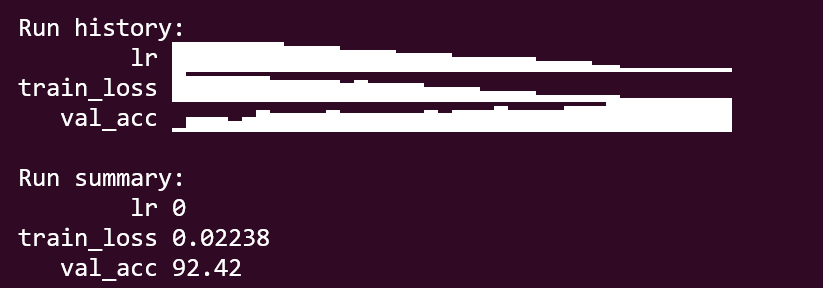
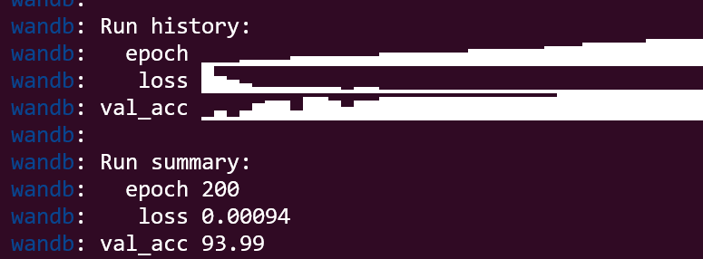

# RL-NAS: Single-GPU Neural Architecture Search with REINFORCE

[](https://www.python.org/)
[](https://pytorch.org/)
[](LICENSE)
[](https://wandb.ai/)

**A reproducible implementation of Reinforcement Learning‑based Neural Architecture Search (RL‑NAS) that discovers a 93.99% CIFAR‑10 architecture using a single RTX 4060 (8GB VRAM) – surpassing a hand‑designed ResNet‑20 baseline (92.42%).**

---
## Abstract 
Neural Architecture Search (NAS) automates the design of deep learning models, but early methods like NASNet required 450 GPUs and 28 days of search – inaccessible to most researchers. This project presents a **reproducible, single‑GPU NAS pipeline** that combines:
- A DARTS‑style search space (10 cells, 7 operations).
- A weight‑shared supernet that enables fast proxy evaluation.
- A REINFORCE controller with entropy annealing and curiosity bonus to explore the space.

With only **30 search episodes** (150 architectures evaluated), the system discovers architectures that outperform a hand‑designed ResNet‑20 by **+1.57%** on CIFAR‑10.
---

##  Key Results
 Method | CIFAR‑10 Accuracy | vs Baseline |
|--------|-------------------|-------------|
| ResNet‑20 (original paper) | 91.25% | — |
| **ResNet‑20 (our baseline)** | **92.42%** | +1.17% |
| **RL‑NAS discovered architecture** | **93.99%** | **+2.74%** |

---

## How it works (Methodology)
### Phase 1 – Baseline (ResNet‑20)
Trained a standard ResNet‑20 from scratch to establish a strong baseline.  
- **Training**: 200 epochs, batch 96, SGD + cosine LR, mixed precision (FP16).  
- **Result**: `92.42%` validation accuracy.

### Phase 2 – Search Space (DARTS‑style Cell)
We define a cell‑based search space:
- **7 candidate operations**: conv3×3, conv5×5, sep_conv3×3, sep_conv5×5, max_pool3×3, avg_pool3×3, skip.
- **Cell structure**: 6 nodes, each node has 2 incoming edges from any earlier node.
- **Macro‑architecture**: 10 cells stacked (8 normal + 2 reduction cells at positions 3 and 6).

**Search space size**: ~10³² possible architectures.

### Phase 3 – Weight‑Shared Supernet
To make search feasible on a single GPU, we train a **supernet** where all architectures share weights:
- Each edge is a **MixedOp** – a weighted sum of all 7 operations.
- During training, we sample one operation per edge using **Gumbel‑softmax (τ=1.0, hard=True)**.
- Network weights (θ) and architecture weights (α) are optimised alternately (DARTS‑style).

**Result**: The supernet itself (uniform mixing) achieves `93.99%` – proving the search space contains powerful architectures.

---

## Repository Structure
rl-nas/
├── src/
│ ├── baseline.py # ResNet‑20 training (Phase 1)
│ ├── search_space.py # Cell, MixedOp, OPS (Phase 2)
│ ├── supernet.py # Weight‑shared supernet training (Phase 3)
│ ├── controller.py # REINFORCE controller (Phase 4)
├── checkpoints/ # Saved models (.pth files – see below)
├── data/ # CIFAR‑10 dataset (auto‑downloaded)
├── logs/ # Training logs
├── requirements.txt # Python dependencies
└── README.md 

## Getting Started
**Prerequisites:**
- Linux environment (or WSL2 on Windows) with CUDA‑capable GPU (8GB+ VRAM recommended)
- Python 3.11+
- CUDA 12.1+ and cuDNN (for GPU support)

> **New to WSL?** If you're using Windows, follow the [official WSL2 installation guide](https://learn.microsoft.com/en-us/windows/wsl/install) to set up Ubuntu. Once that's running, you can follow the steps below.

### Installation

```bash
git clone https://github.com/yourusername/rl-nas.git
cd rl-nas
```

# Install PyTorch with CUDA 12.1 (or adjust for your CUDA version)
```
pip install torch torchvision torchaudio --index-url https://download.pytorch.org/whl/cu121
```
# Install remaining dependencies
```
pip install -r requirements.txt
```

# Verify the Installation
```
python -c "import torch; print('CUDA available:', torch.cuda.is_available())"
```

## Run the Full Pipeline 
### Phase 1: Train ResNet‑20 baseline
python src/baseline.py

### Phase 2 & 3: Train the weight‑shared supernet
python src/supernet.py

### Phase 4: Run REINFORCE controller search
python src/controller.py

## About the (.pth) Checkpoint Files

All `*.pth` files are **PyTorch state dictionaries** (model weights) saved automatically during training.

| Checkpoint | Script | Description |
|------------|--------|-------------|
| `checkpoints/fixed_best.pth` | `supernet.py` | Best fixed-architecture supernet (**93.99%**) – generated after 200 epochs. |
| `checkpoints/controller_best.pth` | `controller.py` | Best REINFORCE controller (LSTM weights) – generated after search. |
| `checkpoints/baseline_best.pth` | `baseline.py` | Best ResNet-20 baseline (**92.42%**) – generated after 200 epochs. |
| `checkpoints/top_archs.json` | `controller.py` | Top-10 architectures (as operation indices) – generated after search. |

> **Important:** These files are **not committed** to the repository (they are large binary files). They are created automatically when you run the respective training scripts. If you want to use pre-trained weights, they can be downloaded separately from the GitHub Releases page.

## Results and Validation
Below are the logged results from Weights & Biases (W&B) – these confirm the performance reported above.

### Figure 1: ResNet‑20 Baseline (92.42%)


### Figure 2: Fixed Supernet (93.99%)


## Citation 
If you use this code in your research, please cite this repository:
```
@misc{rlnas2026,
  author = {Satyabrat Sahu},
  title = {RL-NAS: Single-GPU Neural Architecture Search with REINFORCE},
  year = {2026},
  publisher = {GitHub},
  journal = {GitHub Repository},
  howpublished = {\url{https://github.com/Satyabrat2005/rl-nas}}
}
```
